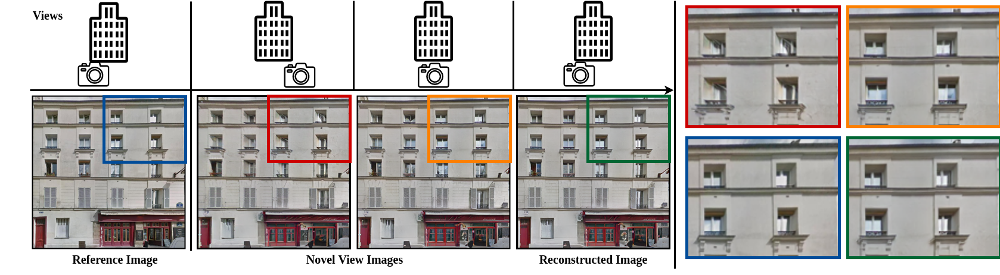

# FacadeNet

## FacadeNet's code is built based on the swapping-autoencoder [repo](https://github.com/taesungp/swapping-autoencoder-pytorch) code structure



## Conda Environment
#### Create new conda environment
```conda env create -f environment.yml```

## Datasets
#### Structure 
Root
  - Facades(Rectified facade images downloaded from [lsaa]( dataset)
  - horizontal maps
  - vertical maps
  - DINO features(Extract features using [DINOv2](https://github.com/facebookresearch/dinov2))
  - Depth
#### Click on the link to download the data: [Link](https://ucy-my.sharepoint.com/:u:/g/personal/ygeorg01_ucy_ac_cy/EeRsI0F7qSBIpjwD14GJwWQB70jq0BZqytzUZoUd30I7Vg?e=TVYkan)

## Training
#### Change data file paths in config file (experiments/facades_vec_pc_lr_launcher.py)
#### Run 
```python -m experiments facades_vec_pc_lr train facadenet```

## Testing
#### Change data file paths in config file (experiments/facades_vec_pc_lr_launcher.py)
#### Create folder named checkpoints/facadenet/
#### Download facadenet pre-trained weights [Link](https://ucy-my.sharepoint.com/:u:/g/personal/ygeorg01_ucy_ac_cy/Ea2k-iAIC5VOjX0MByNAGFQB83nwrIqbM9ed1XEO_W_1vg?e=FuT9Ol) in  checkpoints/facadenet/ folder
#### Run
```python -m experiments facades_vec_pc_lr test facadenet```
